# Gemini Live API Testing

A testing framework for Google's Gemini Live API using the Google AI Development Kit (ADK) with integrated Google Search capabilities.

## 🚀 Overview

This project demonstrates how to create an intelligent search agent using Google's Gemini Live API. The agent can perform real-time research and answer questions by leveraging Google Search integration through the Google ADK framework.

## 📋 Table of Contents

- [Features](#features)
- [Architecture](#architecture)
- [Prerequisites](#prerequisites)
- [Installation](#installation)
- [Configuration](#configuration)
- [Usage](#usage)
- [API Reference](#api-reference)
- [Project Structure](#project-structure)
- [Troubleshooting](#troubleshooting)
- [Contributing](#contributing)

## ✨ Features

| Feature | Description | Status |
|---------|-------------|--------|
| **Real-time Search** | Live Google Search integration | ✅ Implemented |
| **Gemini Live API** | Uses latest Gemini 2.5 Flash Preview | ✅ Implemented |
| **Expert Research** | AI agent with research capabilities | ✅ Implemented |
| **Modular Design** | Clean, extensible architecture | ✅ Implemented |
| **Streaming Support** | Real-time response streaming | ⚡ Ready |

## 🏗️ Architecture

### System Overview

```mermaid
graph TB
    subgraph "Client Layer"
        U[👤 User]
        UI[🖥️ User Interface]
    end
    
    subgraph "Application Layer"
        subgraph "Google ADK Framework"
            A[🤖 Gemini Live Agent]
            T[🔧 Google Search Tool]
        end
        
        subgraph "Configuration"
            C[⚙️ Agent Config]
            E[🌍 Environment Variables]
        end
    end
    
    subgraph "External Services"
        subgraph "Google Cloud Platform"
            GM[🧠 Gemini Live API]
            GS[🔍 Google Search API]
        end
    end
    
    subgraph "Data Flow"
        Q[📝 Query Processing]
        R[📊 Results Analysis]
        P[🎯 Response Generation]
    end
    
    U --> UI
    UI --> A
    A --> Q
    Q --> T
    T --> GS
    GS --> R
    R --> A
    A --> GM
    GM --> P
    P --> UI
    UI --> U
    
    C --> A
    E --> A
    E --> T
    
    style U fill:#e3f2fd
    style A fill:#fff3e0
    style GM fill:#e8f5e8
    style GS fill:#f3e5f5
    style P fill:#e1f5fe
```



### Sequence Diagram


### Component Architecture

```mermaid
graph LR
    subgraph "Project Structure"
        subgraph "app/"
            subgraph "google_search_agent/"
                I[__init__.py]
                A[agent.py]
            end
        end
        
        subgraph "Configuration Files"
            R[requirements.txt]
            G[.gitignore]
            E[.env]
            README[README.md]
        end
    end
    
    subgraph "Core Components"
        Agent[🤖 Agent Instance]
        Tools[🔧 Search Tools]
        Models[🧠 Gemini Models]
    end
    
    A --> Agent
    Agent --> Tools
    Agent --> Models
    E --> Agent
    R --> Agent
    
    style Agent fill:#fff3e0
    style Tools fill:#f3e5f5
    style Models fill:#e8f5e8
```



### Data Flow Process

1. **Initialization**: Agent loads with Gemini Live model and Google Search tool
2. **Query Reception**: User submits research question through interface
3. **Query Analysis**: Agent analyzes intent and determines search strategy
4. **Search Execution**: Google Search tool performs targeted web searches
5. **Result Processing**: Search results are filtered and analyzed
6. **AI Processing**: Gemini Live API generates expert-level responses
7. **Response Delivery**: Formatted answer delivered with citations and sources

## 🔧 Prerequisites

| Requirement | Version | Purpose |
|-------------|---------|---------|
| **Python** | 3.8+ | Runtime environment |
| **Google Cloud Account** | - | API access and authentication |
| **Gemini API Key** | - | Gemini Live API access |
| **Google Search API** | - | Search functionality |

## 📦 Installation

### 1. Clone the Repository

```bash
git clone <repository-url>
cd gemini-live-api-testing
```

### 2. Create Virtual Environment

```bash
python -m venv venv
source venv/bin/activate  # On Windows: venv\Scripts\activate
```

### 3. Install Dependencies

```bash
pip install -r requirements.txt
```

**Note**: There's a typo in the requirements filename (`reuirements.txt`). Please rename it to `requirements.txt`.

## ⚙️ Configuration

### Environment Setup

Create a `.env` file in the project root:

```env
# Google API Configuration
GOOGLE_API_KEY=your_google_api_key_here
GOOGLE_SEARCH_ENGINE_ID=your_search_engine_id

# Gemini Configuration
GEMINI_MODEL_ID=gemini-live-2.5-flash-preview

# Optional: Logging and Debug
LOG_LEVEL=INFO
DEBUG_MODE=false
```

### Supported Models

| Model ID | Description | Features |
|----------|-------------|----------|
| `gemini-live-2.5-flash-preview` | Latest preview model | Fast, efficient |
| `gemini-2.0-flash-live-001` | Stable release | Production ready |
| `gemini-2.0-flash-live-preview-04-09` | Specific preview build | Beta features |

> 📝 **Note**: Check the [official documentation](https://google.github.io/adk-docs/get-started/streaming/quickstart-streaming/#supported-models) for the latest supported models.

## 🎯 Usage

### Quick Start

```python
from app.google_search_agent.agent import root_agent

# Initialize the agent
agent = root_agent

# Simple query
response = agent.query("What are the latest developments in AI?")
print(response)
```

### Advanced Usage Examples

#### 1. Research Query with Context

```python
from app.google_search_agent.agent import root_agent

# Complex research query
query = """
Research the impact of quantum computing on cybersecurity. 
Include recent developments, potential threats, and mitigation strategies.
"""

response = root_agent.query(query)
print(f"Research Results:\n{response}")
```

#### 2. Custom Agent Configuration

```python
from google.adk.agents import Agent
from google.adk.tools import google_search

# Specialized agent for technical research
tech_agent = Agent(
    name="technical_research_agent",
    model="gemini-live-2.5-flash-preview",
    description="Specialized agent for in-depth technical research",
    instruction="""
    You are a senior technical researcher with expertise in:
    - Software engineering and architecture
    - Emerging technologies and trends
    - Scientific publications and papers
    - Industry best practices
    
    Always provide:
    - Accurate, well-sourced information
    - Multiple perspectives on technical topics
    - Practical implications and recommendations
    - Recent developments and future outlook
    """,
    tools=[google_search],
    # Advanced configuration
    temperature=0.3,  # Lower for more focused responses
    max_tokens=2000,
    top_p=0.8
)

# Use the specialized agent
response = tech_agent.query("Explain microservices architecture patterns")
```

#### 3. Streaming Responses

```python
import asyncio
from app.google_search_agent.agent import root_agent

async def streaming_search(query):
    """Handle streaming responses from Gemini Live"""
    try:
        # Enable streaming mode
        stream = root_agent.stream(query)
        
        print("🔍 Searching and analyzing...")
        async for chunk in stream:
            print(chunk, end='', flush=True)
            
    except Exception as e:
        print(f"Error during streaming: {e}")

# Run streaming example
asyncio.run(streaming_search("Latest trends in machine learning"))
```

### Configuration Matrix

| Use Case | Model | Temperature | Max Tokens | Top P | Description |
|----------|-------|-------------|------------|-------|-------------|
| **General Research** | `gemini-live-2.5-flash-preview` | 0.7 | 1000 | 0.9 | Balanced creativity and accuracy |
| **Technical Analysis** | `gemini-live-2.5-flash-preview` | 0.3 | 2000 | 0.8 | Focused, detailed responses |
| **Creative Exploration** | `gemini-live-2.5-flash-preview` | 0.9 | 1500 | 0.95 | High creativity, broad exploration |
| **Fact Checking** | `gemini-live-2.5-flash-preview` | 0.1 | 800 | 0.7 | Maximum accuracy, minimal creativity |
```

## 📚 API Reference

### Agent Configuration

| Parameter | Type | Required | Description | Default | Example |
|-----------|------|----------|-------------|---------|---------|
| `name` | `str` | ✅ | Unique agent identifier | - | `"research_agent"` |
| `model` | `str` | ✅ | Gemini model ID | - | `"gemini-live-2.5-flash-preview"` |
| `description` | `str` | ✅ | Agent purpose description | - | `"Expert research assistant"` |
| `instruction` | `str` | ✅ | Behavior instructions | - | `"You are an expert researcher"` |
| `tools` | `list` | ❌ | Available tools | `[]` | `[google_search]` |
| `temperature` | `float` | ❌ | Response creativity (0.0-1.0) | `0.7` | `0.3` |
| `max_tokens` | `int` | ❌ | Maximum response length | `1000` | `2000` |
| `top_p` | `float` | ❌ | Nucleus sampling (0.0-1.0) | `0.9` | `0.8` |

### Method Reference

#### Agent.query()

```python
def query(
    self, 
    prompt: str, 
    context: Optional[Dict] = None,
    stream: bool = False
) -> Union[str, AsyncGenerator]:
    """
    Execute a query against the agent.
    
    Args:
        prompt: The user's question or request
        context: Optional context for the query
        stream: Enable streaming responses
        
    Returns:
        String response or async generator for streaming
        
    Raises:
        APIError: When API request fails
        ValidationError: When input validation fails
    """
```

#### Google Search Tool

```python
from google.adk.tools import google_search

# Tool configuration
google_search.configure(
    max_results=10,           # Number of search results
    search_type="web",        # Search type: web, images, news
    language="en",            # Search language
    region="us",              # Search region
    safe_search="moderate"    # Safe search: off, moderate, strict
)
```

### Response Format

```python
{
    "response": "Generated response text...",
    "metadata": {
        "model": "gemini-live-2.5-flash-preview",
        "tokens_used": 847,
        "search_queries": ["AI developments 2024", "machine learning trends"],
        "sources": [
            {
                "title": "Latest AI Breakthroughs",
                "url": "https://example.com/ai-news",
                "snippet": "Recent developments in..."
            }
        ],
        "processing_time": 3.2
    },
    "status": "success"
}
```

## 🎯 Best Practices

### Query Optimization

```mermaid
graph TD
    A[📝 User Query] --> B{Query Analysis}
    
    B -->|Simple| C[🔍 Direct Search]
    B -->|Complex| D[📊 Multi-step Research]
    B -->|Ambiguous| E[❓ Clarification]
    
    C --> F[🎯 Targeted Results]
    D --> G[📚 Comprehensive Analysis]
    E --> H[🔄 Refined Query]
    
    F --> I[✅ Quick Response]
    G --> J[✅ Detailed Response]
    H --> B
    
    style A fill:#e3f2fd
    style I fill:#c8e6c9
    style J fill:#c8e6c9
```



### Performance Guidelines

| Guideline | Recommendation | Impact |
|-----------|----------------|--------|
| **Query Length** | 50-200 characters | ⚡ Faster processing |
| **Context Limits** | < 2000 tokens | 💾 Memory efficiency |
| **Concurrent Requests** | < 5 simultaneous | 🚦 Rate limit compliance |
| **Caching Strategy** | 15-minute TTL | 🏃 Response speed |
| **Error Handling** | Exponential backoff | 🛡️ Reliability |

### Security Considerations

#### Input Validation

```python
import re
from typing import Optional

def validate_query(query: str) -> Optional[str]:
    """Validate and sanitize user queries."""
    
    # Check length
    if len(query) > 1000:
        return "Query too long (max 1000 characters)"
    
    # Check for malicious patterns
    dangerous_patterns = [
        r'<script.*?>.*?</script>',  # XSS
        r'SELECT.*FROM.*WHERE',       # SQL injection
        r'javascript:',               # JavaScript injection
    ]
    
    for pattern in dangerous_patterns:
        if re.search(pattern, query, re.IGNORECASE):
            return "Query contains potentially unsafe content"
    
    return None  # Valid query

# Usage
def safe_query(agent, user_input: str):
    """Safely execute user queries with validation."""
    
    validation_error = validate_query(user_input)
    if validation_error:
        return {"error": validation_error, "status": "invalid"}
    
    try:
        response = agent.query(user_input)
        return {"response": response, "status": "success"}
    except Exception as e:
        return {"error": str(e), "status": "error"}
```

#### API Key Management

```python
import os
from pathlib import Path

def load_secure_config():
    """Load configuration securely."""
    
    # Priority order: environment variables > .env file > default
    config = {
        'api_key': os.getenv('GOOGLE_API_KEY'),
        'model': os.getenv('GEMINI_MODEL_ID', 'gemini-live-2.5-flash-preview'),
        'debug': os.getenv('DEBUG_MODE', 'false').lower() == 'true'
    }
    
    # Validate required configuration
    if not config['api_key']:
        raise ValueError("GOOGLE_API_KEY environment variable is required")
    
    return config
```

### Error Handling Strategy

```python
import asyncio
import logging
from typing import Union

async def robust_query(agent, query: str, max_retries: int = 3) -> Union[str, dict]:
    """Execute query with robust error handling and retries."""
    
    for attempt in range(max_retries):
        try:
            response = await agent.query(query)
            return response
            
        except APIError as e:
            if e.status_code == 429:  # Rate limit
                wait_time = 2 ** attempt  # Exponential backoff
                logging.warning(f"Rate limited, waiting {wait_time}s")
                await asyncio.sleep(wait_time)
                continue
            elif e.status_code >= 500:  # Server error
                logging.error(f"Server error: {e}")
                continue
            else:  # Client error
                return {"error": f"Client error: {e}", "status": "failed"}
                
        except NetworkError as e:
            logging.warning(f"Network error on attempt {attempt + 1}: {e}")
            await asyncio.sleep(1)
            continue
            
        except Exception as e:
            logging.error(f"Unexpected error: {e}")
            return {"error": f"Unexpected error: {e}", "status": "failed"}
    
    return {"error": "Max retries exceeded", "status": "failed"}
```

## 📁 Project Structure

```
gemini-live-api-testing/
├── 📄 README.md                    # Project documentation
├── 📄 requirements.txt             # Python dependencies
├── 📄 .gitignore                   # Git ignore rules
├── 📄 .env                         # Environment variables (create this)
└── 📁 app/
    └── 📁 google_search_agent/
        ├── 📄 __init__.py          # Package initialization
        └── 📄 agent.py             # Main agent configuration
```

## 🔍 Troubleshooting

### Common Issues & Solutions

| Issue | Symptoms | Cause | Solution |
|-------|----------|-------|----------|
| **Import Error** | `ModuleNotFoundError: No module named 'google.adk'` | Missing dependencies | `pip install -r requirements.txt` |
| **Authentication Failed** | `401 Unauthorized` | Invalid API credentials | Verify `.env` file and API keys |
| **Model Not Found** | `Model 'xyz' not supported` | Outdated model ID | Check [supported models](https://google.github.io/adk-docs/get-started/streaming/quickstart-streaming/#supported-models) |
| **Search Timeout** | Slow or failed searches | Network/API limits | Check rate limits and connection |
| **Memory Issues** | `OutOfMemoryError` | Large response processing | Reduce `max_tokens` or implement streaming |

### Debug Workflow

```mermaid
flowchart TD
    A[❌ Issue Detected] --> B{Check Error Type}
    
    B -->|Import Error| C[📦 Verify Dependencies]
    B -->|Auth Error| D[🔐 Check Credentials]
    B -->|Model Error| E[🧠 Verify Model ID]
    B -->|Network Error| F[🌐 Check Connectivity]
    
    C --> G[pip install -r requirements.txt]
    D --> H[Validate .env file]
    E --> I[Update model configuration]
    F --> J[Test API endpoints]
    
    G --> K[✅ Test Import]
    H --> L[✅ Test Authentication]
    I --> M[✅ Test Model Load]
    J --> N[✅ Test Search]
    
    K --> O{Issue Resolved?}
    L --> O
    M --> O
    N --> O
    
    O -->|Yes| P[🎉 Continue Development]
    O -->|No| Q[📋 Create Issue Report]
    
    style A fill:#ffcdd2
    style P fill:#c8e6c9
    style Q fill:#fff3e0
```



### Debug Commands

1. **Environment Check**
   ```bash
   # Check Python version
   python --version
   
   # Verify virtual environment
   which python
   
   # List installed packages
   pip list | grep google
   ```

2. **API Connectivity Test**
   ```python
   import os
   from google.adk.agents import Agent
   
   # Test environment variables
   api_key = os.getenv('GOOGLE_API_KEY')
   print(f"API Key loaded: {'✅' if api_key else '❌'}")
   
   # Test basic agent creation
   try:
       from app.google_search_agent.agent import root_agent
       print(f"✅ Agent loaded: {root_agent.name}")
   except Exception as e:
       print(f"❌ Agent load failed: {e}")
   ```

3. **Search Functionality Test**
   ```python
   from app.google_search_agent.agent import root_agent
   
   # Simple test query
   try:
       response = root_agent.query("test search query")
       print("✅ Search working correctly")
   except Exception as e:
       print(f"❌ Search failed: {e}")
   ```

## 📊 Performance & Monitoring

### Performance Metrics

| Metric | Target | Measurement | Optimization |
|--------|--------|-------------|--------------|
| **Response Time** | < 5 seconds | Average query processing | Use streaming, optimize prompts |
| **Search Accuracy** | > 90% | Relevant results ratio | Improve search queries, filters |
| **API Rate Limits** | < 80% usage | Requests per minute | Implement caching, batching |
| **Memory Usage** | < 1GB | Peak memory consumption | Streaming, garbage collection |

### Monitoring Dashboard

```mermaid
graph LR
    subgraph "Metrics Collection"
        A[📊 Response Times]
        B[🎯 Accuracy Scores]
        C[🔄 API Usage]
        D[💾 Memory Usage]
    end
    
    subgraph "Monitoring Tools"
        E[📈 Performance Logs]
        F[⚠️ Error Tracking]
        G[📋 Usage Analytics]
    end
    
    subgraph "Alerts"
        H[🚨 High Latency]
        I[❌ Error Rates]
        J[⚡ Rate Limits]
    end
    
    A --> E
    B --> E
    C --> G
    D --> E
    
    E --> H
    F --> I
    G --> J
    
    style A fill:#e3f2fd
    style E fill:#e8f5e8
    style H fill:#ffcdd2
```



## 🚀 Deployment

### Local Development

```bash
# 1. Clone and setup
git clone <repository-url>
cd gemini-live-api-testing
python -m venv venv
source venv/bin/activate

# 2. Install dependencies
pip install -r requirements.txt

# 3. Configure environment
cp .env.example .env
# Edit .env with your API keys

# 4. Test installation
python -c "from app.google_search_agent.agent import root_agent; print('✅ Setup complete')"
```

### Production Deployment

#### Docker Configuration

```dockerfile
FROM python:3.9-slim

WORKDIR /app

# Copy requirements and install dependencies
COPY requirements.txt .
RUN pip install --no-cache-dir -r requirements.txt

# Copy application code
COPY app/ ./app/
COPY .env .

# Set environment variables
ENV PYTHONPATH=/app
ENV GOOGLE_APPLICATION_CREDENTIALS=/app/credentials.json

# Health check
HEALTHCHECK --interval=30s --timeout=10s --start-period=5s --retries=3 \
  CMD python -c "from app.google_search_agent.agent import root_agent" || exit 1

# Run application
CMD ["python", "-m", "app.google_search_agent"]
```

#### Kubernetes Deployment

```yaml
apiVersion: apps/v1
kind: Deployment
metadata:
  name: gemini-live-agent
spec:
  replicas: 3
  selector:
    matchLabels:
      app: gemini-live-agent
  template:
    metadata:
      labels:
        app: gemini-live-agent
    spec:
      containers:
      - name: agent
        image: gemini-live-agent:latest
        ports:
        - containerPort: 8080
        env:
        - name: GOOGLE_API_KEY
          valueFrom:
            secretKeyRef:
              name: api-secrets
              key: google-api-key
        resources:
          requests:
            memory: "256Mi"
            cpu: "250m"
          limits:
            memory: "512Mi"
            cpu: "500m"
```

### Environment-Specific Configuration

| Environment | Model | Rate Limit | Caching | Monitoring |
|-------------|-------|------------|---------|------------|
| **Development** | `gemini-live-2.5-flash-preview` | Unlimited | Disabled | Basic logging |
| **Staging** | `gemini-live-2.5-flash-preview` | 100/min | 5 minutes | Full monitoring |
| **Production** | `gemini-2.0-flash-live-001` | 1000/min | 15 minutes | Advanced monitoring |

## 🤝 Contributing

1. Fork the repository
2. Create a feature branch (`git checkout -b feature/amazing-feature`)
3. Commit your changes (`git commit -m 'Add amazing feature'`)
4. Push to the branch (`git push origin feature/amazing-feature`)
5. Open a Pull Request

## 📜 License

This project is licensed under the MIT License - see the LICENSE file for details.

## 🔗 Useful Links

| Resource | URL |
|----------|-----|
| Google ADK Documentation | https://google.github.io/adk-docs/ |
| Gemini API Reference | https://ai.google.dev/api |
| Supported Models | https://google.github.io/adk-docs/get-started/streaming/quickstart-streaming/#supported-models |

## 📞 Support

For questions and support:
- 📧 Create an issue in this repository
- 📚 Check the [Google ADK documentation](https://google.github.io/adk-docs/)
- 💬 Join the Google AI community forums

---

**Happy Coding! 🚀**
